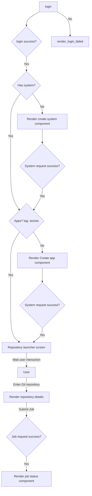

# Sites and Stories using TAPIS API

This is under development.

The React app will run Jupyter notebooks stored on Git repository on TACC's HPC systems using the TAPIS API.

## Capabilities

- [x] Login to TAPIS.
- [x] Create an TAPIS application
- [x] UI to submit a TAPIS Jobs API request (Git repository has been hardcoded)

## Design (under development)

The steps are:

1. Login to TAPIS
2. Validate that the user has a TAPIS system
   1. If the user does not have a TAPIS system, create a TAPIS system
   2. Ask the user password to the TAPIS system
3. Validate that the user has a TAPIS application

   1. If the user does not have a TAPIS application, create a TAPIS application
   2. The TAPIS application are provided by the Stories' team. These are related to the Docker images that are used to run the Jupyter notebooks.

4. The user enters the URL of the Git repository
5. UI renders the repository README.md file and a button to submit the repository as a job
6. User submit the job
   1. UI creates the TAPIS Jobs API request using the Git repository URL as the parameter
   2. UI submits the TAPIS Jobs API request
   3. UI displays the status of the job
   4. UI displays the output of the job

The following diagram shows the flow of the application.

## How to use

In the project directory, you can run:

### `npm start`

Runs the app in the development mode.\
Open [http://localhost:3000](http://localhost:3000) to view it in the browser.

The page will reload if you make edits.\
You will also see any lint errors in the console.
