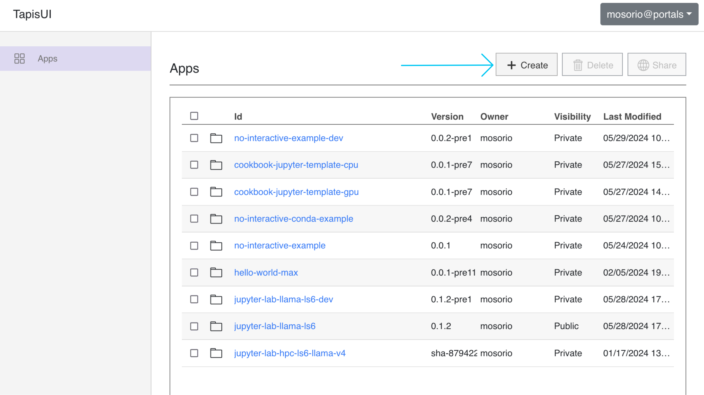
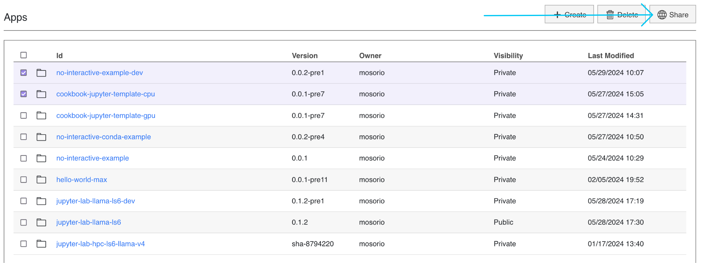
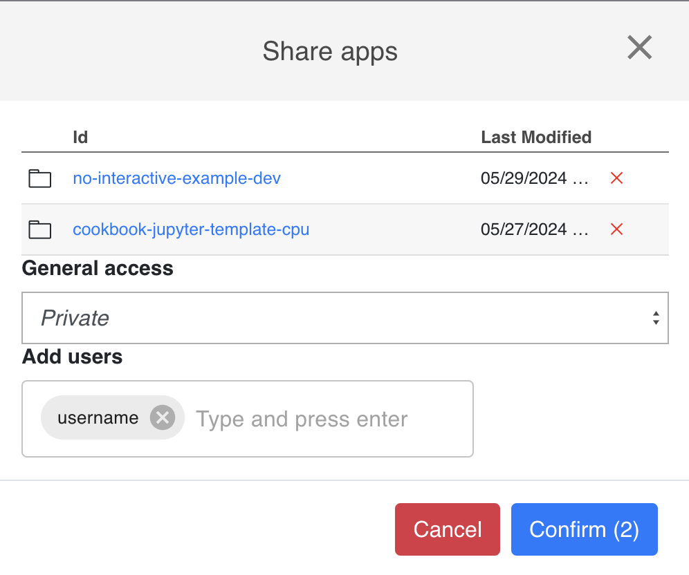
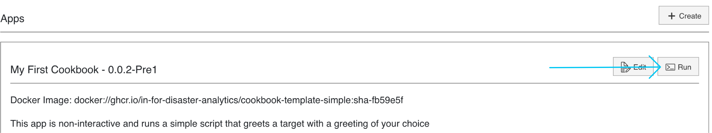
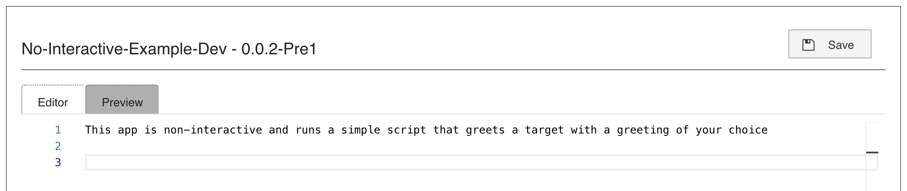

## Create Application

1. Go to [Cookbook UI](https://in-for-disaster-analytics.github.io/cookbooks-ui/#/apps)
2. Click on the "Create Application" button
3. Fill in the form with the information from your `app.json` file
4. Click "Create Application"
5. A new application will be created, and you will be redirected to the application's page

## Share Application

1. Go to the application's page
2. Select one or more applications to share
3. Click on the "Share" button
   

4. Fill in the form:
   - **General access**: If you want to share the application with everyone in the tenant, select "Public". If you want to share the application with specific users, go to "Add users"
   - **Add users**: Write the username of the users you want to share the application with
     

## Run Application

1. Go to the application's page
2. Click on the application to run it
3. Click on the "Run" button
   

## Add documentation to Application

1. Go to the application's page
2. Click on the application to add documentation
3. Click on the "Edit" button
4. Write the documentation using markdown
   
5. Click on the "Save" button

## Delete Application

1. Go to the application's page
2. Select one or more applications to delete
3. Click on the "Delete" button
   
4. Confirm the deletion

## Request Application on Cookbook
